# 🌐 VibeFlow — Social Media React App

## 📌 Overview

**VibeFlow** is a modern social media web application built with React that simulates a real-world social platform experience.
It allows users to register, log in, create posts, interact through comments, and manage their profiles in a responsive and user-friendly environment.

The project focuses on **scalable architecture, performance optimization, and real-world frontend practices**, including authentication workflows, API integration, server-state management, and UX enhancements.

---

## 🚀 Live Demo

👉 [https://vibeflow-blush.vercel.app/](https://vibeflow-blush.vercel.app/)

---

## 🛠 Tech Stack

### Frontend

- React (Vite)
- React Router DOM (Protected & Dynamic Routing)
- Context API (Authentication State)
- TanStack Query / React Query (Server State Management)

### Styling & UI

- Tailwind CSS
- Flowbite UI Components
- Responsive Design
- Skeleton Loaders & Modals

### Forms & Validation

- React Hook Form
- Zod Schema Validation

### API & Networking

- Axios
- REST API Integration
- Environment Variables Handling

### Optimization & Advanced Tools

- Lazy Loading (Code Splitting)
- useMemo / useCallback Optimization
- React Helmet (SEO Management)
- Offline Detection
- Pagination Support

---

## ✨ Core Features

### 🔐 Authentication System

- Secure user registration & login
- Schema-based form validation
- Protected routes and session persistence
- Global authentication state with Context API

### 📝 Posts System

- Create, view, and delete posts
- Global feed and profile-specific posts
- Dynamic routing for post details

### 💬 Social Interaction

- Add and edit comments
- Optimistic UI updates with React Query
- Human-friendly date formatting

### 👤 Profile Management

- Profile data display
- Profile image upload with validation
- User-specific content history

### ⚡ Performance & UX Enhancements

- Skeleton loading states
- Automatic data caching & background refetching
- Offline status detection
- Toast notifications
- Pagination for large datasets

---

## 📂 Project Architecture

The application follows a **feature-based scalable structure**, ensuring maintainability and separation of concerns:

```bash
src/
├── components/      # Shared UI components (Buttons, Inputs, etc.)
│   └── ui/
├── features/        # Feature-specific logic
│   ├── auth/        # Authentication components & logic
│   ├── posts/       # Posts components & logic
│   └── profile/     # Profile components & logic
├── pages/           # Application Views/Pages
├── hooks/           # Custom Reusable Hooks
├── context/         # Global State (Auth, Theme, etc.)
├── utils/           # Helper functions & Formatters
└── routing/         # Router Configuration & Guards

This structure improves maintainability, scalability, and separation of concerns in larger applications.
```

---

## 🧠 Key Learning Outcomes

- Building a full social media frontend from scratch
- Managing authentication and protected routing
- Understanding server vs client state management
- Implementing React Query caching & mutations
- Applying performance optimization techniques
- Designing reusable components and custom hooks
- Structuring scalable React applications

---

## ⚙️ Installation & Setup

```bash
git clone https://github.com/Ybassam7/Vibeflow.git
cd Vibeflow
npm install
npm run dev
```

Create a `.env` file:

```
VITE_BASE_URL = "https://linked-posts.routemisr.com"
```

---

## 📸 Screenshots

|                Login Page                 |                 Registration Page                 |
| :---------------------------------------: | :-----------------------------------------------: |
| 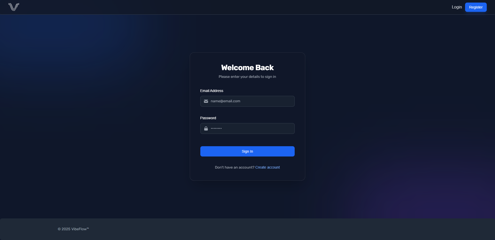 | 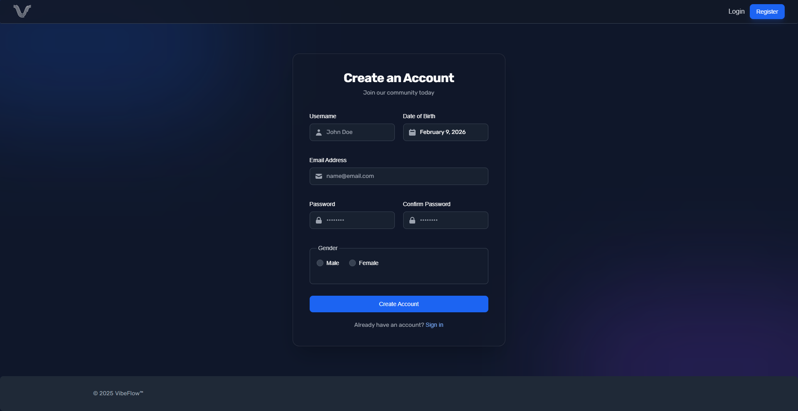 |

|                Global Feed                 |                  Post Details                  |
| :----------------------------------------: | :--------------------------------------------: |
| 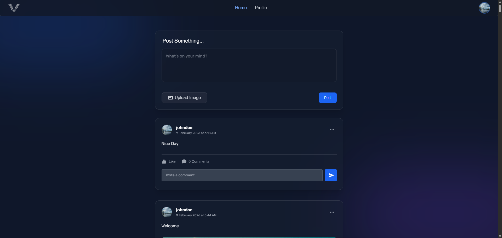 |  |

|                User Profile                |              404 Not Found Page              |
| :----------------------------------------: | :------------------------------------------: |
| 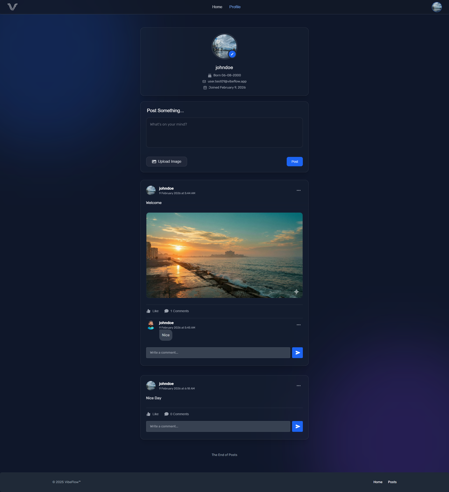 | 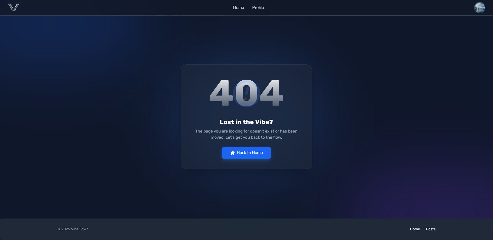 |

|                Edit & Delete                 |               Action Confirmation               |
| :------------------------------------------: | :---------------------------------------------: |
| 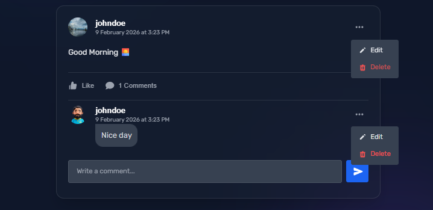 | 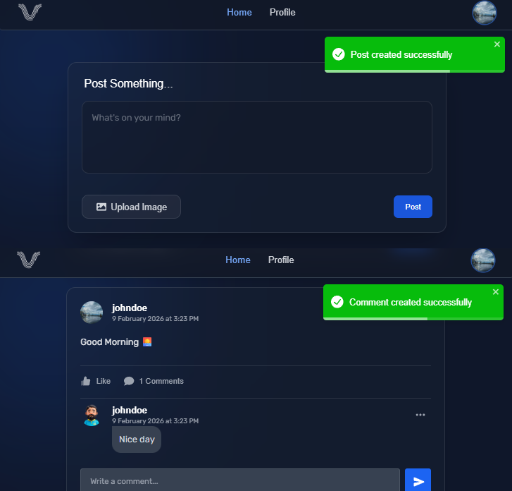 |

|                  Post Loading                  |                  Post Skeleton                   |
| :--------------------------------------------: | :----------------------------------------------: |
| 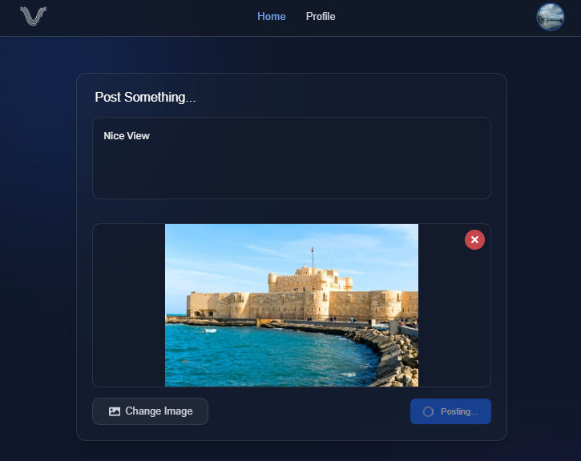 | 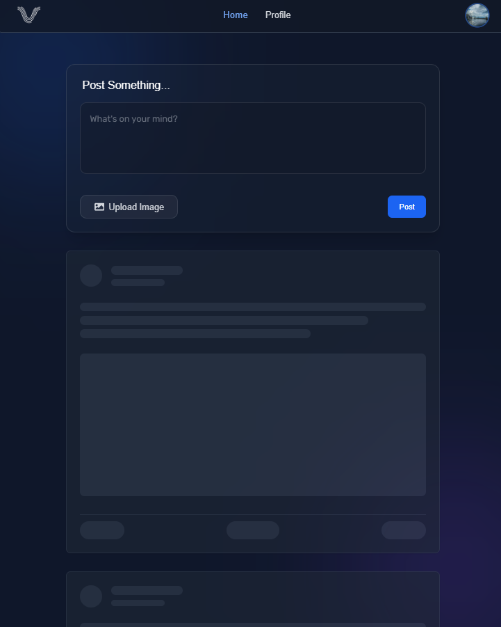 |

|                  Post Preview                  |                   Network Status                   |
| :--------------------------------------------: | :------------------------------------------------: |
| 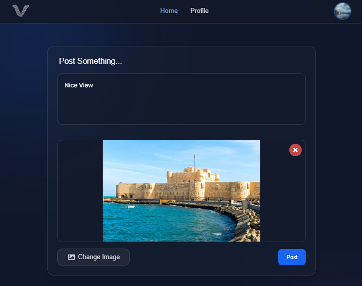 | 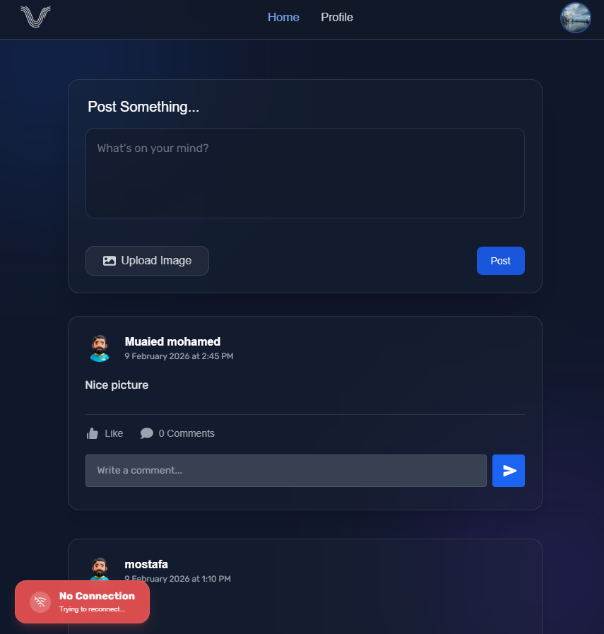 |

|                Edit Post                 |               Delete Confirmation                |
| :--------------------------------------: | :----------------------------------------------: |
|  | 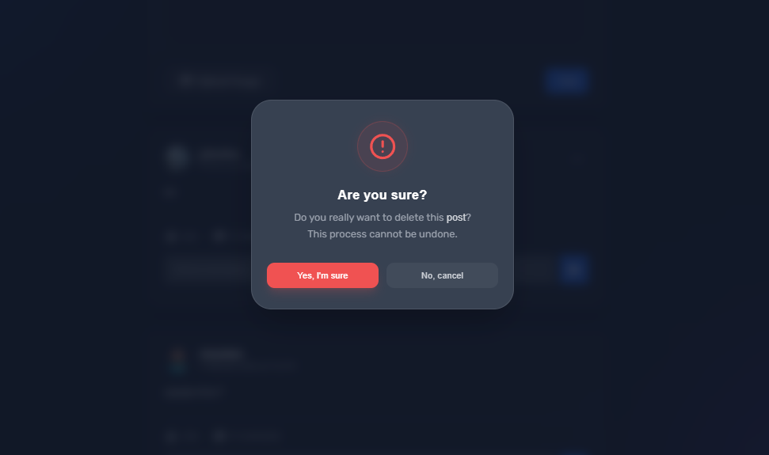 |

---

## 👨‍💻 Author

**Youssef Bassam**
Frontend React Developer

GitHub: [https://github.com/Ybassam7](https://github.com/Ybassam7)
